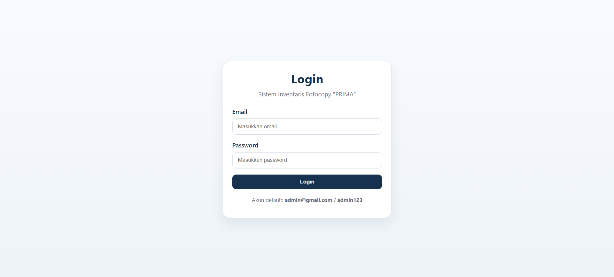
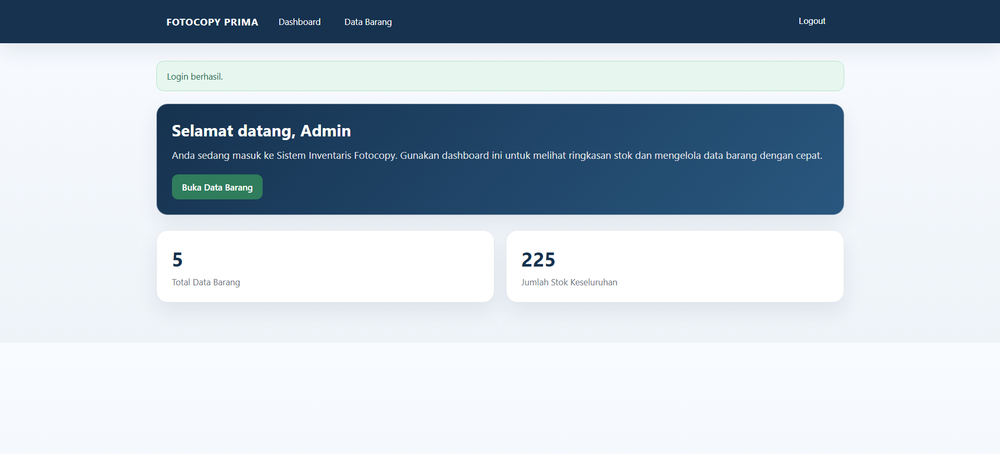
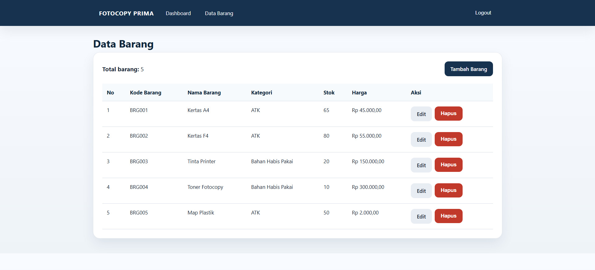
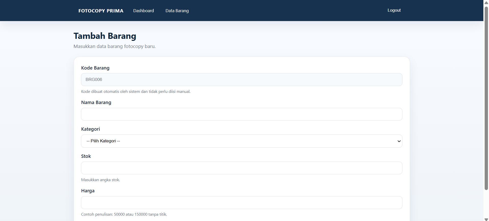
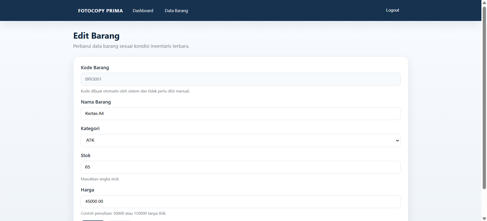
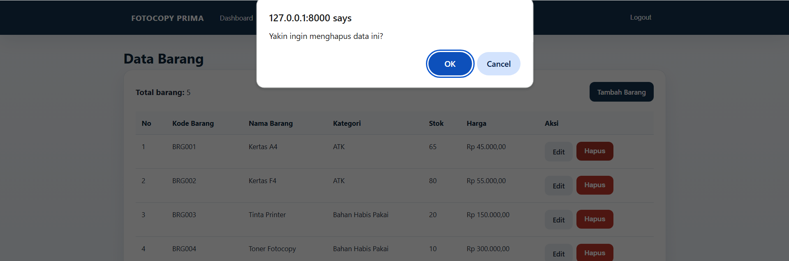

# Sistem Inventaris Fotocopy

## Identitas Mahasiswa
- Nama: Isi nama kamu
- NIM: Isi NIM kamu
- Program Studi: Isi program studi kamu
- Kelas: Isi kelas kamu

---

## Tema Kasus
Project ini mengangkat tema **sistem inventaris alat dan perlengkapan fotocopy berbasis web**.  
Sistem dibuat untuk membantu pengelolaan data barang secara digital agar proses pencatatan inventaris menjadi lebih rapi, cepat, dan mudah dipantau.

---

## Latar Belakang
Pengelolaan inventaris pada usaha fotocopy sering kali masih dilakukan secara manual, baik untuk pencatatan nama barang, kategori, jumlah stok, maupun harga barang.  
Cara manual seperti ini dapat menimbulkan kendala seperti data yang mudah tercecer, kesalahan pencatatan, serta kesulitan saat ingin mengetahui kondisi stok barang secara cepat.

Melalui sistem ini, proses pengelolaan inventaris dibuat dalam bentuk digital sehingga admin dapat login ke sistem, melihat dashboard, menambah data barang, mengubah data barang, dan menghapus data barang dengan lebih terstruktur.  
Dengan adanya sistem inventaris ini, pengelolaan barang pada usaha fotocopy diharapkan menjadi lebih efisien dan mudah dipantau.

---

## Tujuan Sistem
- Mempermudah admin dalam mengelola data inventaris barang
- Mempermudah pencatatan stok barang secara digital
- Membantu admin mengetahui jumlah stok barang dengan lebih cepat
- Mengurangi kesalahan pencatatan data inventaris
- Membuat proses pengelolaan barang menjadi lebih rapi dan terorganisir

---

## Fitur Utama
- Login admin
- Dashboard inventaris
- Menampilkan total data barang
- Menampilkan total stok barang
- Menambah data barang
- Mengedit data barang
- Menghapus data barang
- Pengelompokan barang berdasarkan kategori

---

## Akun Login Default
- Email: `admin@gmail.com`
- Password: `admin123`

---

## Halaman Sistem

### 1. Login

Halaman login digunakan admin untuk masuk ke dalam sistem menggunakan email dan password yang telah terdaftar.  
Pada halaman ini admin harus mengisi email dan password dengan benar agar dapat mengakses sistem inventaris fotocopy.

### 2. Dashboard

Dashboard menampilkan ringkasan data inventaris seperti total data barang dan total stok keseluruhan.  
Halaman ini juga memberikan sambutan kepada admin serta menyediakan tombol cepat untuk menuju halaman data barang.

### 3. Data Barang

Halaman data barang digunakan untuk menampilkan seluruh daftar inventaris yang tersimpan di dalam sistem.  
Informasi yang ditampilkan meliputi kode barang, nama barang, kategori, stok, harga, serta tombol aksi untuk edit dan hapus data.

### 4. Tambah Barang

Halaman tambah barang digunakan admin untuk memasukkan data inventaris baru ke dalam sistem.  
Admin dapat mengisi nama barang, kategori, stok, dan harga, sedangkan kode barang dibuat otomatis oleh sistem.

### 5. Edit Barang

Halaman edit barang digunakan untuk memperbarui data inventaris yang sudah ada sesuai kondisi terbaru.  
Pada halaman ini admin dapat mengubah informasi barang seperti nama barang, kategori, stok, dan harga.

### 6. Hapus Barang

Fitur hapus barang digunakan untuk menghapus data inventaris yang sudah tidak diperlukan dari sistem.  
Saat tombol hapus dipilih, sistem akan menampilkan konfirmasi terlebih dahulu agar admin tidak menghapus data secara tidak sengaja.

---

## Repository
[GitHub Project](https://github.com/billapsf/inventaris-fotocopy)
